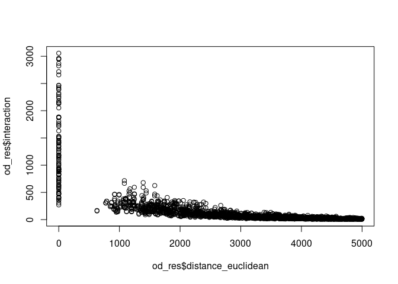

<!-- badges: start -->

[](https://github.com/robinlovelace/si/actions)
<!-- badges: end -->

The goal of {si} is to provide a simple and flexible framework for
developing spatial interaction models (SIMs), which estimate the amount
of movement between spatial entities.

<!-- # Implementations in other languages -->

## si basics

Install the package as follows:

``` r
install.packages("remotes") # if not already installed
```

``` r
remotes::install_github("robinlovelace/si")
```

Run a basic SIM as follows:

``` r
library(si)
od = si_to_od(
  origins = si_zones,
  destinations = si_zones,
  max_dist = 5000
  )
```

    2505 OD pairs remaining after removing those with a distance greater than 5000 meters:
    22% of all possible OD pairs

``` r
gravity_model = function(od, beta) {
  od[["origin_all"]] * od[["destination_all"]] *
    exp(-beta * od[["distance_euclidean"]] / 1000)
} 
od_res = si_model(od, fun = gravity_model, beta = 0.3, var_p = origin_all)
plot(od_res$distance_euclidean, od_res$res)
```



What just happened? As the example above shows, the package
allows/encourages you to define and use your own functions to estimate
the amount of interaction/movement between places. The resulting
estimates of interaction, returned in the column `res` and plotted with
distance in the graphic above, resulted from our choice of spatial
interaction model inputs, allowing a wide range of alternative
approaches to be implemented. This flexibility is a key aspect of the
package, enabling small and easily modified functions to be implemented
and tested.

The output `si_model()` is a geographic object which can be plotted as a
map:

``` r
plot(od_res["res"], logz = TRUE)
```


The `si_to_od()` function transforms geographic entities (typically
polygons and points) into a data frame representing the full combination
of origin-destination pairs that are less than `max_dist` meters apart.
A common saying in data science is that 80% of the effort goes into the
pre-processing stage. This is equally true for spatial interaction
modelling as it is for other types of data intensive analysis/modelling
work. So what does this function return?

``` r
names(od)
```

     [1] "O"                         "D"                        
     [3] "distance_euclidean"        "origin_geo_name"          
     [5] "origin_lad11cd"            "origin_lad_name"          
     [7] "origin_all"                "origin_bicycle"           
     [9] "origin_foot"               "origin_car_driver"        
    [11] "origin_car_passenger"      "origin_motorbike"         
    [13] "origin_train_tube"         "origin_bus"               
    [15] "origin_taxi_other"         "destination_geo_name"     
    [17] "destination_lad11cd"       "destination_lad_name"     
    [19] "destination_all"           "destination_bicycle"      
    [21] "destination_foot"          "destination_car_driver"   
    [23] "destination_car_passenger" "destination_motorbike"    
    [25] "destination_train_tube"    "destination_bus"          
    [27] "destination_taxi_other"    "geometry"                 

As shown in the output above, the function allows you to use any
variable in the origin or destination data in the function, with column
names appended with `origin` and `destination`.

Note: support for OD datasets in which the origins and destinations are
different objects is work in progress (see
[\#3](https://github.com/Robinlovelace/si/issues/3)).

## Feedback

We would be interested to hear how the approach presented in this
package compared with other implementations such as those presented in
the links below. If anyone would like to try the approach or implement
it in another language feel free to get in touch via the issue tracker.

## Further reading

For details on what SIMs are and how they have been defined
mathematically and in code from first principles, see the [`sims`
vignette](https://robinlovelace.github.io/si/articles/sims-first-principles.html).

To dive straight into using {si} to develop SIMs, see the [`si` Get
started vignette](https://robinlovelace.github.io/si/articles/si.html).

For a detailed introduction to SIMs, support by reproducible R code, see
Adam Dennett’s [2018 paper](https://doi.org/10.37970/aps.v2i2.38).

## Other SIM packages

-   The [`spflow` R package](https://github.com/LukeCe/spflow) on CRAN
-   The [`spint` Python
    package](https://spint.readthedocs.io/en/latest/)
