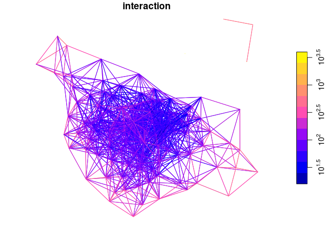

<!-- badges: start -->

[](https://github.com/robinlovelace/si/actions)
<!-- badges: end -->

The goal of {si} is to provide a simple and flexible framework for
developing spatial interaction models (SIMs), which estimate the amount
of movement between spatial entities.

## Installation

Install the package as follows:

``` r
install.packages("remotes") # if not already installed
```

``` r
remotes::install_github("robinlovelace/si")
```

<!-- # Implementations in other languages -->

## si basics

Run a basic SIM as follows:

``` r
library(si)
library(dplyr)
```


    Attaching package: 'dplyr'

    The following objects are masked from 'package:stats':

        filter, lag

    The following objects are masked from 'package:base':

        intersect, setdiff, setequal, union

``` r
# prepare OD data
od = si_to_od(
  origins = si_zones,        # origin locations
  destinations = si_zones,   # destination locations
  max_dist = 5000            # maximum distance between OD pairs
  )
```

    2505 OD pairs remaining after removing those with a distance greater than 5000 meters:
    22% of all possible OD pairs

``` r
# specify a function
gravity_model = function(beta, d, m, n) {
  m * n * exp(-beta * d / 1000)
} 
# perform SIM
od_res = si_calculate(
  od,
  fun = gravity_model,
  d = distance_euclidean,
  m = origin_all,
  n = destination_all,
  constraint_p = origin_all,
  beta = 0.3
  )
# visualize the results
plot(od_res$distance_euclidean, od_res$interaction)
```


What just happened? We created an ‘OD data frame’ from geographic
origins and destinations, and then estimated a simple gravity model
based on the population in origin and destination zones and a custom
distance decay function. As the example above shows, the package
allows/encourages you to define and use your own functions to estimate
the amount of interaction/movement between places.

Note: this approach also allows you to use {si} functions in {dplyr}
pipelines:

``` r
od_res = od %>% 
  si_calculate(fun = gravity_model, 
               m = origin_all,
               n = destination_all,
               d = distance_euclidean,
               beta = 0.3)
od_res %>% 
  select(interaction)
```

    Simple feature collection with 2505 features and 1 field
    Geometry type: LINESTRING
    Dimension:     XY
    Bounding box:  xmin: -1.743949 ymin: 53.71552 xmax: -1.337493 ymax: 53.92906
    Geodetic CRS:  WGS 84
    First 10 features:
       interaction                       geometry
    1      7890481 LINESTRING (-1.400108 53.92...
    2      2290854 LINESTRING (-1.400108 53.92...
    3      2290854 LINESTRING (-1.346497 53.92...
    4      5697769 LINESTRING (-1.346497 53.92...
    5      1850756 LINESTRING (-1.346497 53.92...
    6      6105841 LINESTRING (-1.704658 53.91...
    7      5753720 LINESTRING (-1.704658 53.91...
    8      2202388 LINESTRING (-1.704658 53.91...
    9      2053541 LINESTRING (-1.704658 53.91...
    10     1430755 LINESTRING (-1.704658 53.91...

The resulting estimates of interaction, returned in the column
`interaction` and plotted with distance in the graphic above, resulted
from our choice of spatial interaction model inputs, allowing a wide
range of alternative approaches to be implemented. This flexibility is a
key aspect of the package, enabling small and easily modified functions
to be implemented and tested.

The output `si_calculate)` is a geographic object which can be plotted
as a map:

``` r
plot(od_res["interaction"], logz = TRUE)
```



The `si_to_od()` function transforms geographic entities (typically
polygons and points) into a data frame representing the full combination
of origin-destination pairs that are less than `max_dist` meters apart.
A common saying in data science is that 80% of the effort goes into the
pre-processing stage. This is equally true for spatial interaction
modelling as it is for other types of data intensive analysis/modelling
work. So what does this function return?

``` r
names(od)
```

     [1] "O"                         "D"                        
     [3] "distance_euclidean"        "origin_geo_name"          
     [5] "origin_lad11cd"            "origin_lad_name"          
     [7] "origin_all"                "origin_bicycle"           
     [9] "origin_foot"               "origin_car_driver"        
    [11] "origin_car_passenger"      "origin_motorbike"         
    [13] "origin_train_tube"         "origin_bus"               
    [15] "origin_taxi_other"         "destination_geo_name"     
    [17] "destination_lad11cd"       "destination_lad_name"     
    [19] "destination_all"           "destination_bicycle"      
    [21] "destination_foot"          "destination_car_driver"   
    [23] "destination_car_passenger" "destination_motorbike"    
    [25] "destination_train_tube"    "destination_bus"          
    [27] "destination_taxi_other"    "geometry"                 

As shown in the output above, the function allows you to use any
variable in the origin or destination data in the function, with column
names appended with `origin` and `destination`.

Note: support for OD datasets in which the origins and destinations are
different objects is work in progress (see
[\#3](https://github.com/Robinlovelace/si/issues/3)).

## Feedback

We would be interested to hear how the approach presented in this
package compared with other implementations such as those presented in
the links below. If anyone would like to try the approach or implement
it in another language feel free to get in touch via the issue tracker.

## Further reading

For details on what SIMs are and how they have been defined
mathematically and in code from first principles, see the [`sims`
vignette](https://robinlovelace.github.io/si/articles/sims-first-principles.html).

To dive straight into using {si} to develop SIMs, see the [`si` Get
started vignette](https://robinlovelace.github.io/si/articles/si.html).

For a detailed introduction to SIMs, support by reproducible R code, see
Adam Dennett’s [2018 paper](https://doi.org/10.37970/aps.v2i2.38).

## Other SIM packages

-   The [`spflow` R package](https://github.com/LukeCe/spflow) on CRAN
-   The [`spint` Python
    package](https://spint.readthedocs.io/en/latest/)
-   The [`gravity`](https://cran.r-project.org/package=gravity) R
    package
